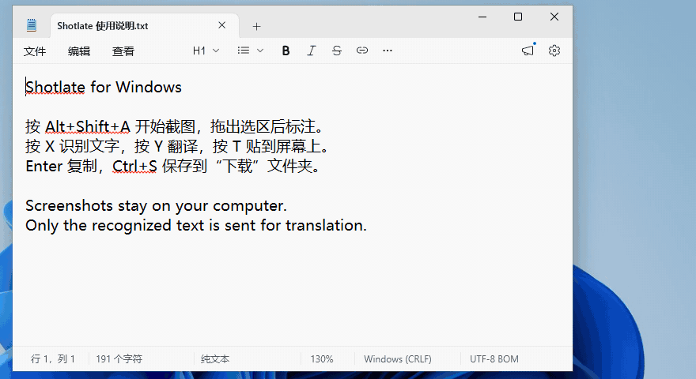
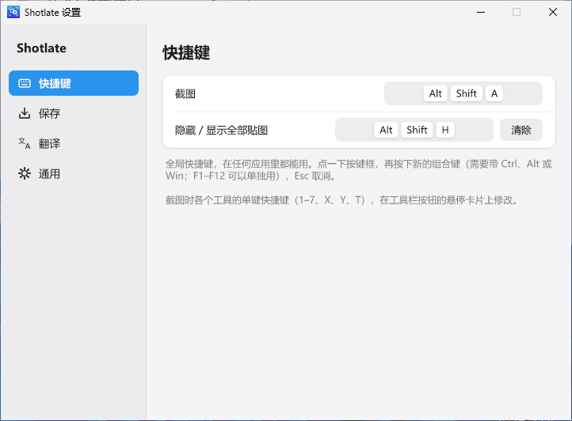

# Shotlate for Windows

[Shotlate](https://github.com/zuijiaosy/shotlate) 的 Windows 版：截图 → 标注 → 复制 / 保存 / 贴图 / 识别文字 / 翻译到原位。小而精，常驻托盘。

- 文字识别在本机完成（PP-OCRv6，首次启动时下载约 23 MB 的识别组件）。
- 翻译使用 OpenAI 兼容接口，默认是 DeepSeek 的 `deepseek-flash`。只发送识别出的文字，截图本身不上传。
- Rust 编写，安装包约 7 MB，x64 和 ARM64 都有原生版本。支持 Windows 10 2004 及以上、Windows 11。
- 小：常驻托盘时内存约 20 MB；识别文字时临时升到 100 多 MB，空闲一分钟后回落。

官网：[shotlate.pages.dev](https://shotlate.pages.dev) · 下载：[最新版本](https://github.com/zuijiaosy/shotlate-win/releases/latest)

在 Windows 11 上的一次完整截图：悬停选中窗口，框选，画框、箭头和序号，按 X 识别文字；再按 T 贴到屏幕上，直接在贴图上选中、复制文字。

设置界面：左侧四个分类，改动立即生效。

## 功能

- **截图**：按 `Alt+Shift+A`（可改），拖出选区；鼠标停在窗口上单击就选中那个窗口，单击空白处选中整个屏幕。多块屏幕、不同缩放比例都支持。
- **标注**：矩形、箭头、画笔、马赛克、放大镜、文字、序号，快捷键 `1`–`7`。颜色、粗细、线型按工具记住；滚轮调粗细，`Ctrl+Z` 撤销，`Ctrl+Y` 重做。序号放下后直接输入说明文字。
- **输出**：`Enter` 或双击选区复制，`Ctrl+S` 保存到“下载”文件夹，`Ctrl+Shift+S` 另存为，`T` 贴到屏幕上。
- **识别文字**（`X`）：离线识别，结果在可编辑的面板里，点“复制”才复制。
- **翻译到原位**（`Y`）：把选区里的外文翻译后直接画在原来的位置，再按一次 `Y` 切换原文。
- **贴图**：拖动移动，滚轮缩放，`Ctrl+滚轮` 调透明度，右键菜单复制、保存、关闭；`Alt+Shift+H` 隐藏 / 显示全部贴图。
- **贴图上选文字**：鼠标移到贴图的文字上会变成 I 形光标，可以拖选、双击选词、三击选行，`Ctrl+A` 全选，`Ctrl+C` 复制文字（没选中文字时复制图片）。

工具栏按钮的单键快捷键可以改：鼠标停在按钮上半秒，在弹出的卡片上点按键，再按新的键。

## 安装

从 [Releases](https://github.com/zuijiaosy/shotlate-win/releases/latest) 下载 `Shotlate-<版本>-x64.exe`（大多数电脑）或 `-arm64.exe`（骁龙等 ARM 电脑），双击安装，不需要管理员权限。支持 Windows 10 2004 及以上。

- Windows 可能提示“Windows 已保护你的电脑”：点“更多信息”→“仍要运行”。
- 首次打开会询问是否下载文字识别组件（约 23 MB，只需一次）。不下载也能正常截图、标注、复制、保存和贴图，以后可以在 设置 → 通用 里下载。
- 有新版本时会提示，由你决定何时安装。

## 翻译需要 API Key

只截图、标注、识别文字的话不用填。需要翻译时：

1. 登录 DeepSeek 开放平台 [platform.deepseek.com](https://platform.deepseek.com)；
2. 充值，最少 1 元；
3. 在「API Keys」里创建一个 Key，复制后粘贴到 托盘图标 → 设置 → 翻译。

Key 加密保存在本机。翻译时只发送识别出的文字，截图本身不会上传。

## 开发

见 [AGENTS.md](AGENTS.md)。README 里的动图和设置截图由 `Shotlate.exe --e2e <输出目录> demo` 在 Windows 虚拟机里驱动真实应用录制，再用 ffmpeg 合成（见 AGENTS.md「README 素材」）。
